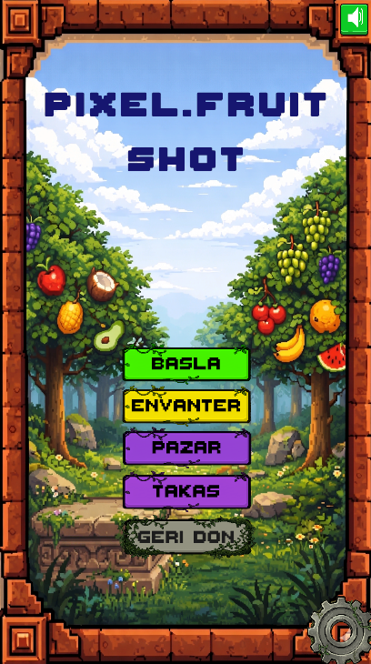
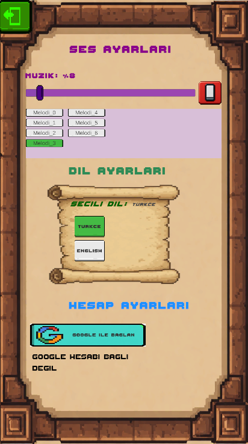
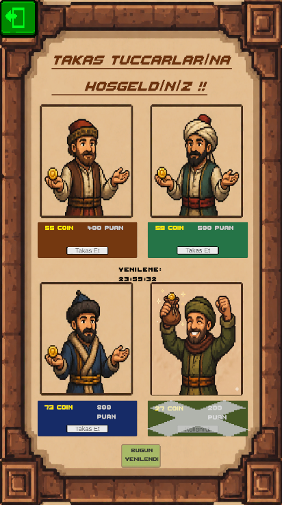
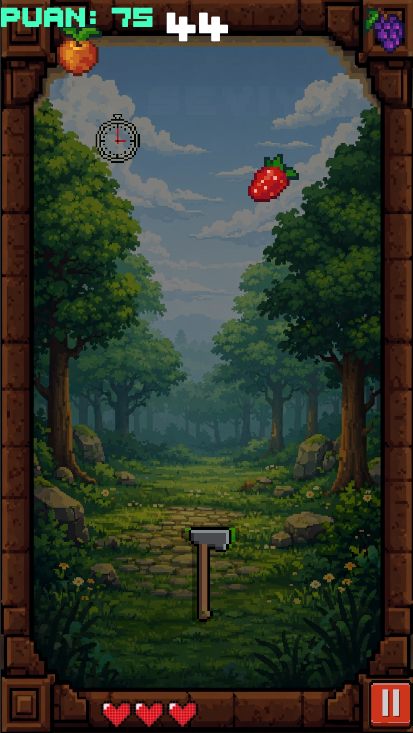

# PixelFruitShot (TargetShot) 🎯

Unity ile geliştirilmiş; gelişmiş oyun mekaniklerine, bulut tabanlı veri senkronizasyonuna ve dinamik bir oyun içi ekonomi sistemine sahip 2D aksiyon oyunu.

## 🚀 Temel Özellikler & Teknik Detaylar

### 1. Güçlü Oyun Mekanikleri
* **Sapan (Slingshot) Mekaniği:** Hesaplanmış maksimum çekme mesafesi ve anında ses geri bildirimi (audio feedback) içeren, fizik tabanlı "çek ve bırak" fırlatma mekaniği geliştirildi.
* **Dinamik Seviye (Level) Sistemi:** Her 30 saniyede bir otomatik olarak ilerleyen ve zorlaşan seviye eğrisi.
  * Seviye 2: Hedeflerin sadece ekranın üst yarısında kalmasını sağlayan sekme (bounce) algoritması.
  * Seviye 3: Her atıştan sonra silahın rastgele yeni bir pozisyona ışınlanması.
* **Can & Bonus Sistemi:** %10 olasılıkla ekranda beliren bonus can (kalp) mekaniği ve UI ile tam senkronize çalışan dinamik can barı.

### 2. Backend & Bulut (Cloud) Entegrasyonu (Firebase)
* **Google Sign-In:** Kullanıcıların kolayca giriş yapabilmesi için Google Auth entegrasyonu sağlandı.
* **Cloud Save (Firestore):** Oyuncu verileri (skor, coin, açılan silahlar, seçili silah) güvenli bir şekilde buluta kaydedilir.
* **Local Fallback:** İnternet bağlantısı olmayan veya misafir olarak giren oyuncular için `PlayerPrefs` kullanılarak robust bir yerel kayıt sistemi kuruldu; böylece ilerleme asla kaybolmaz.

### 3. Dinamik Oyun İçi Ekonomi (Takas Sistemi)
* **Algoritmik Takas:** Her 24 saatte bir, orantısal olarak hesaplanmış (Puan → Coin) rastgele 4 yeni teklif üreten `TakasYoneticisi` sistemi tasarlandı.
* **Zaman Sınırlı Mekanikler:** Yenileme hakkının günde 1 kez olmasını sağlayan ve son yenileme zamanını yerel hafızada tutan 24 saatlik sayaç (cooldown) sistemi uygulandı.
* **Akıcı UI Geribildirimleri:** Takas işlemlerinde görsel onay pullarının (KULLANILDI) yumuşak bir şekilde (fade-in) ekranda belirmesi için Coroutine'ler kullanıldı.

### 4. Gelişmiş Oyun Sistemleri & UI
* **Global Durdurma (Pause) Sistemi:** Zamanı (`Time.timeScale`) durduran, Android donanımsal geri tuşunu algılayan ve coroutine'leri güvenle askıya alan tam kapsamlı bir Pause Manager.
* **Dinamik Ayarlar:** Oyun içi ve ana menüde master ses ve müzik seviyelerini ayarlayan, arka planda çalan müzikleri üst üste bindirmeden dinamik olarak değiştirebilen ayarlar sistemi.

## 🛠️ Kullanılan Teknolojiler
* **Oyun Motoru:** Unity (2D)
* **Dil:** C#
* **Backend:** Firebase (Authentication, Firestore)
* **Eklentiler / Kütüphaneler:** Google Sign-In for Unity, TextMeshPro

## 🧠 Mimari & Tasarım Kalıpları
* Temel sistemlerin (`ScoreManager`, `UserDataManager`, `SeviyeYoneticisi`, `TakasYoneticisi`) oyun yaşam döngüsü boyunca tekil (single-instance) olarak kalması ve veri bütünlüğü için kullanıldı.
* Mekanikler birbirinden izole edildi (Örn: `KnifeThrow` sadece fiziği, `TargetLog` düşman mantığını, `ScoreManager` oyun durumunu yönetir).

